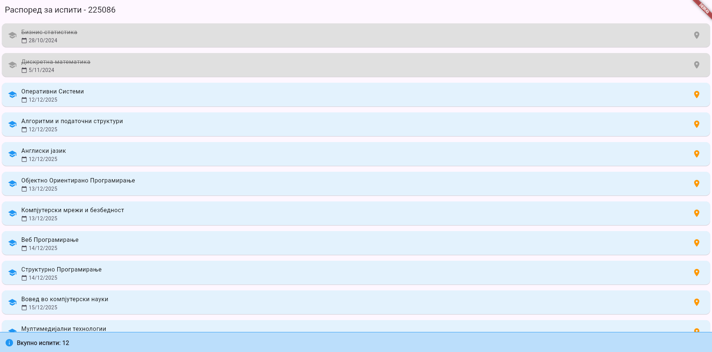
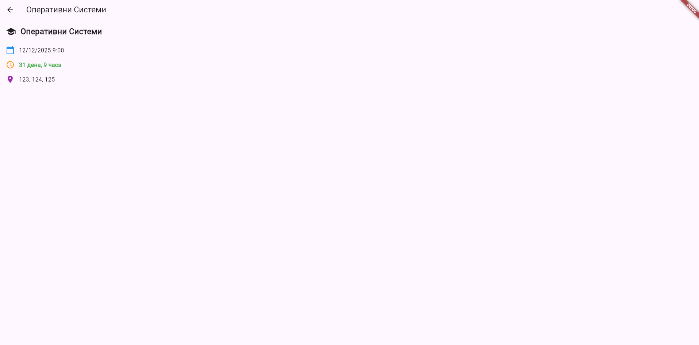

# Lab App - Распоред на испити

Апликација за приказ на распоред на испити развиена со Flutter.

## Функционалности

- Приказ на листа со 12 испити
- Детален преглед на секој испит
- Приказ на време преостанато до испитот
- Приказ на училници за секој испит
- Икони релевантни за секој елемент
- Различни бои за поминати и идни испити
- Хронолошко подредување по датум
- Беџ со вкупен број на испити

## Захтеви

- Flutter SDK
- Android Studio или VS Code
- Dart

## Структура на проектот

```
lib/
├── main.dart
├── models/
│   └── exam.dart
├── screens/
│   ├── exam_list_screen.dart
│   └── exam_detail_screen.dart
└── widgets/
    └── exam_card.dart
```

## Screenshots

### Главен екран - Листа на испити



На главниот екран е комплетната листа на сите 12 испити. Испитите се подредени по датум, почнувајќи од архивираните испити (сива боја) па се до идните испити (синa боја). На дното на екранот има беџ кој покажува вкупен број на испити.

### Детален преглед на испит



Кога кликнете на еден испит, се отвара деталниот преглед. Тука има целосна информација за испитот вклучување датум, време, време преостанато до испитот и сите училници каде се одржува.

## Автор

Стефан Новачки - Индекс 225086